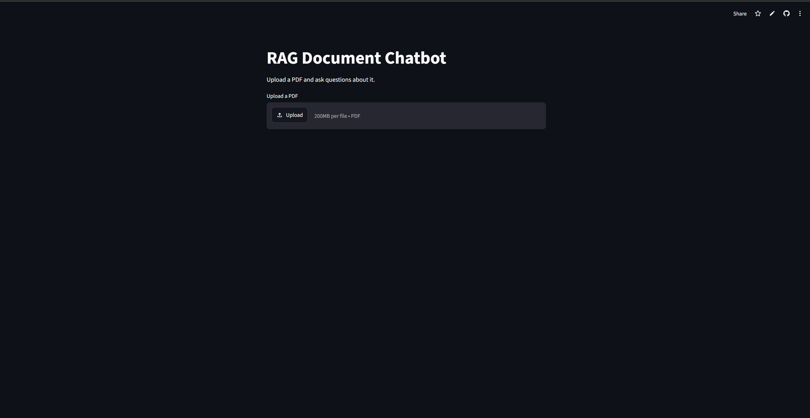

# RAG Document Chatbot

A simple chatbot that answers questions about a PDF you upload. Built with LangChain, ChromaDB, and a Llama model served on Groq.

[](https://rag-document-chatbot-azmhvrsqqtekqenvvy5ajn.streamlit.app/)

**▶ Try it live:** [rag-document-chatbot.streamlit.app](https://rag-document-chatbot-azmhvrsqqtekqenvvy5ajn.streamlit.app/)



## What it does

Upload a PDF, ask a question, and get an answer grounded in the document — not the model's general knowledge. Under the hood it splits the PDF into chunks, embeds them, finds the chunks most relevant to your question, and passes those to the language model to write the answer. If the answer isn't in the document, it says so.

## Tech stack

- **Python** + **Streamlit** — app and UI
- **LangChain** — pipeline glue
- **Sentence Transformers** (`all-MiniLM-L6-v2`) — embeddings, run locally
- **ChromaDB** — vector store for similarity search
- **Groq** (`llama-3.1-8b-instant`) — answer generation

## Setup

1. Clone the repo and create the environment:

   ```bash
   conda create -n rag-chatbot python=3.11 -y
   conda activate rag-chatbot
   pip install -r requirements.txt
   ```

2. Get a free Groq API key from [console.groq.com](https://console.groq.com), then create a file at `.streamlit/secrets.toml` in the project root:

   ```toml
   GROQ_API_KEY = "gsk_your_key_here"
   ```

3. Run the app:

   ```bash
   streamlit run src/app.py
   ```

   It opens in your browser. Upload a PDF and start asking questions.

## How it works

```
PDF → split into chunks → embed → store in ChromaDB
Question → embed → find top matching chunks → send to Groq → answer
```

## Notes

- Embeddings run locally on CPU, so no embedding API or cost.
- The PDF is re-indexed each time the page reloads — fine for small documents, which is all this is built for.
- Retrieval is plain top-k similarity search with no reranking. It's a small, readable project, not a production system.